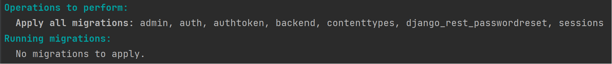

# API Сервис заказа товаров для розничных сетей

[Задание](./reference/diploma_project.md)

[Документация по запросам в Swagger](https://app.swaggerhub.com/apis/ZARIPOVAMARYM/Diploma/1.0.0) 


## Запуск приложения
1. Запускаем контейнер:
```docker-compose up -d --build```
2. Проверяем, запустилась ли база данных и применились ли миграции:
```docker-compose exec web python manage.py migrate --noinput  ```

Должно получиться:


3. Собираем статические файлы
```docker-compose exec web python manage.py collectstatic --no-input --clear  ```
4. Создаем суперпользователя
```docker-compose exec web python manage.py createsuperuser```

### Проверить работоспособность

Отправить запрос на ```http://localhost:1337/admin/```
Документация: ```http://localhost:1337/openapi/```