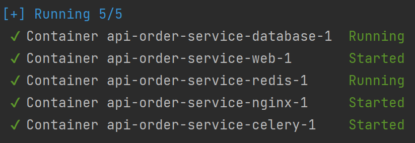
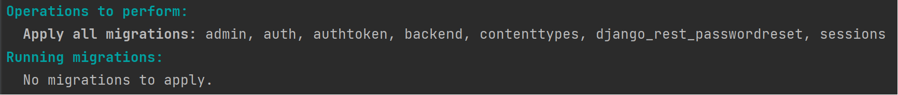

# API Сервис заказа товаров для розничных сетей

[Задание здесь](./reference/diploma_project.md)
## Запуск приложения
1. Запускаем контейнер:

```shell
docker-compose up -d --build
```

Должно получиться:


2. Проверяем, запустилась ли база данных и применились ли миграции:
```shell
docker-compose exec web python manage.py migrate --noinput
```

Должно получиться:


3. Создаем суперпользователя
```shell
docker-compose exec web python manage.py createsuperuser
```

4. Если статика не отображается, собираем статические файлы 
```shell
docker-compose exec web python manage.py collectstatic --no-input --clear
```
## Проверяем работоспособность

Отправить запрос на 
```shell
http://localhost:1337/admin/
```

Документация API: 
```shell
http://localhost:1337/openapi/
```

[Описание документации по запросам в Swagger](https://app.swaggerhub.com/apis/ZARIPOVAMARYM/Diploma/1.0.0) 